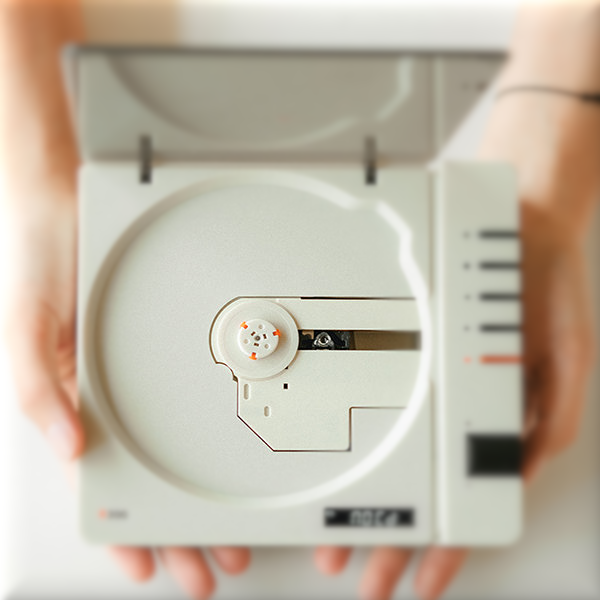

# DigiCD Player 🎵

A digital music format that embeds MP3 audio data within PNG images, creating virtual "CDs" that can be played in a web browser. Built with vanilla JavaScript and styled with CSS.

[Try the DigiCD Player](https://launcher.pcotandy.org)

## How it Works

### 🎯 The DigiCD Format
DigiCDs are PNG images that contain hidden MP3 data, allowing music to be stored and shared as images while maintaining full audio quality. When a DigiCD is loaded into the player, it:

1. Validates the PNG header
2. Extracts the embedded MP3 data
3. Creates an audio blob for playback
